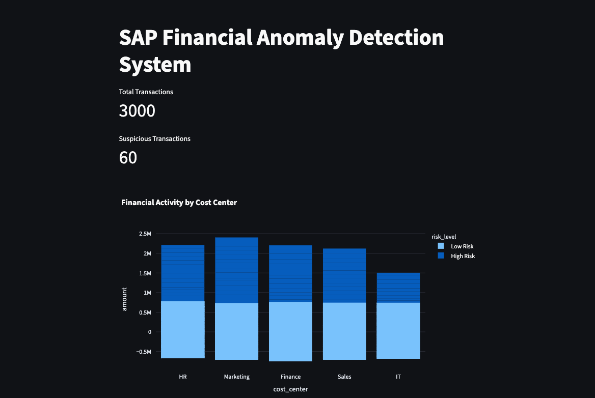
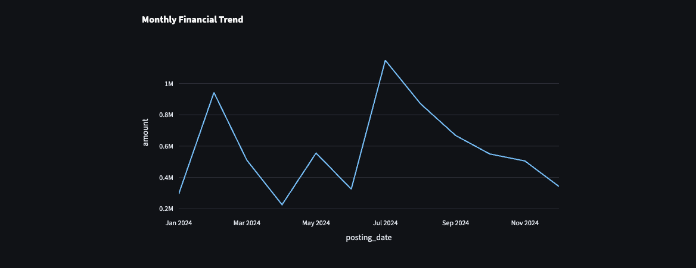
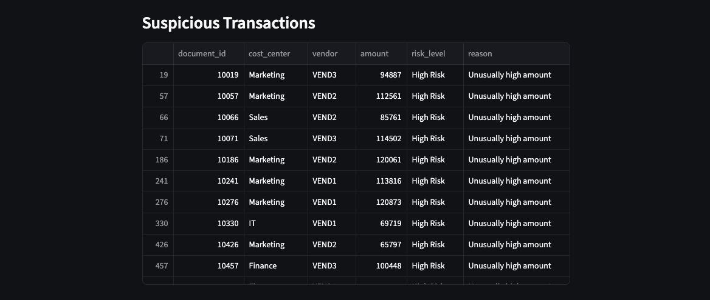
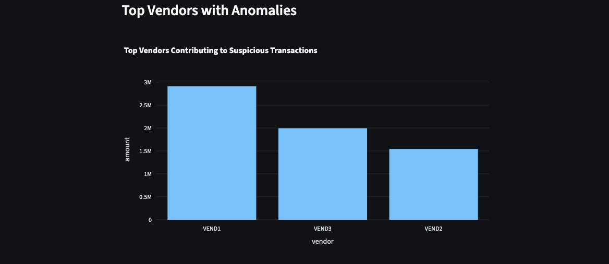
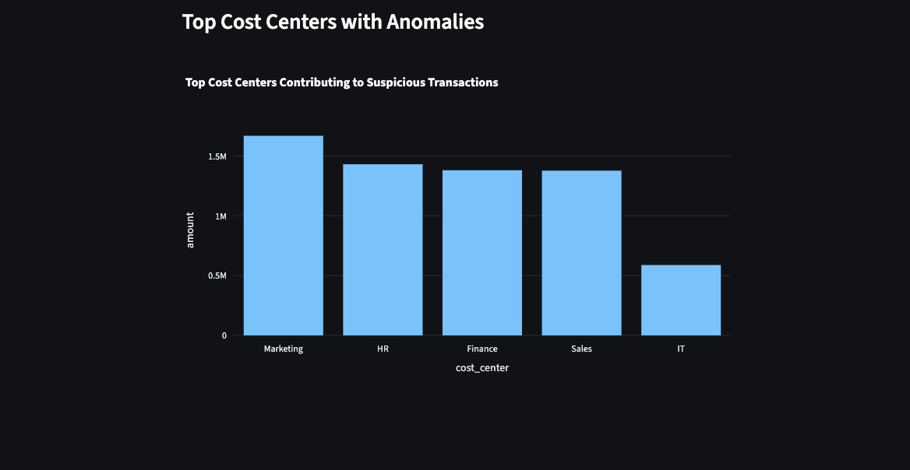

# SAP Financial Anomaly Detection System

This project detects suspicious transactions, assigns risk levels, provides reasons, and visualizes key financial insights in a compact dashboard — ideal for SAP analytics and consulting portfolios.

---

## Business Case

Companies lose millions due to accounting errors, duplicate payments, or fraudulent transactions.  
Finance teams in SAP environments need tools to **quickly detect anomalies** and take action.  

This dashboard demonstrates:

- How AI can detect **financial anomalies** using historical accounting data.  
- Identification of **high-risk vendors** and **cost centers**.  
- A **Power BI-style visual overview** of transactions for decision-makers.

---

## Features

- AI-driven anomaly detection using **Isolation Forest**.  
- Assigns **risk levels** and meaningful **reasons** for each suspicious transaction.  
- Visualizes:
  - Top cost centers contributing to anomalies  
  - Monthly financial trends  
  - Top vendors contributing to anomalies  
- Table of suspicious transactions with **document ID, vendor, cost center, amount, risk, and reason**.  
- Compact, professional **dashboard layout** for quick insights.

---

## Technology Stack

- **Python**  
- **Pandas** for data manipulation  
- **Plotly** for interactive charts  
- **Streamlit** for the dashboard  
- **Scikit-learn** (Isolation Forest) for anomaly detection  

---

## How It Works

1. **Load financial data** (CSV file).  
2. **Detect anomalies** using Isolation Forest based on transaction amounts.  
3. **Assign risk levels** based on amount thresholds.  
4. **Generate reasons** for suspicious transactions:
   - Unusually high amount  
   - High amount outlier  
   - Medium amount outlier  
   - Unexpected negative transaction  
   - Minor anomaly  
5. **Visualize key insights** in a dashboard:
   - KPIs (Total Transactions, Suspicious Transactions, Total Vendors)  
   - Top cost centers and vendors contributing to anomalies  
   - Monthly financial trends  
   - Table of suspicious transactions  

---

## Screenshots

| Dashboard Overview | Monthly Trend |
|-------------------|---------------|
|  |  |

| Suspicious Transactions | Top Vendors |
|-------------------------|------------|
|  |  |

| Top Cost Centers |
|-----------------|
|  |

---

## Note:
This project uses completely synthetic, randomly generated financial data not real company data. I generated fictional transaction records specifically to demonstrate the concept. No real vendor names, no real amounts, no real company data was used at any point. In a real enterprise implementation, this system would connect to SAP via secure APIs with proper role-based access controls, data masking, and compliance with GDPR and company data governance policies.

## Enterprise Implementation Notes:
In a real SAP environment this system would:
- Connect to SAP via RFC or OData APIs
- Use role-based access control (RBAC)
- Apply data masking for sensitive fields
- Comply with GDPR and SOX requirements
- Integrate with SAP Alert Management for notifications

